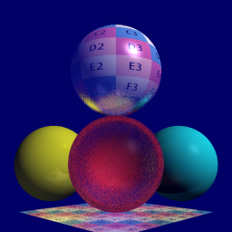

# Haya Luz

Compilation command: `make`\
Execution command: `./haya-luz SampleScenes/Test.scene`

Scene file format key:
```
SKY                 R G B       Scale
CAMERA              OriginX OriginY OriginZ     TargetX TargetY TargetZ     FOV
DIRECTIONAL_LIGHT   Dx Dy Dz    R G B   Scale
POINT_LIGHT         X Y Z       R G B   Scale
AREA_LIGHT          X Y Z   Dx Dy Dz    W H     R G B   Scale
TEXTURE             TexID   Xres Yres   Path
MATERIAL            MatID   KdR KdG KdB KsR KsG KsB KeR KeG KeB Diffuse Specular Roughness Emissivity Transmission IOR TexID
SPHERE              MatID   X Y Z R
TRIANGLE            MatID   X Y Z X Y Z X Y Z
POLYGON             MatID   num_verts   X Y Z ... X Y Z     U V ... U V
```

Example Render:\
